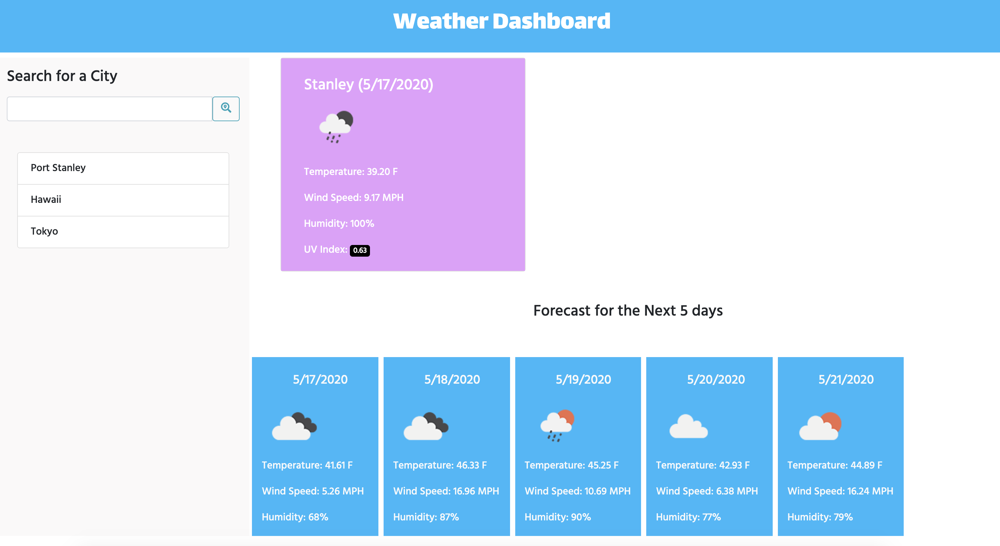

# Weather-Dashboard

## [Weather Dashboard](https://lynseahoss.github.io/Weather-Dashboard/)

----
## Project Overview:
1. Create a weather dashboard using Open Weather Map Api (multiple)
2. Create a function to retrieve data from [Current Weather API](https://openweathermap.org/current) to display City Name, Icon, Temperature & Humidity  
3. Create a function to retrieve data from [UV Index API](https://openweathermap.org/api/uvi) to display UV Index above in step 2.
4. Push city names below the form and use local storage to display city's weather & five day forecast when event listener initiated. 
5. Create function to retrieve data from [5 day / 3 hour Forecast](https://openweathermap.org/forecast5) to display date, icon, temp, & humidty at a specific same hour for the next five days.
6. Create click event listeners to run the functions & display on screen when initiated.

----

## Project Technology

Languages
- HTML
- CSS
- Javascript

Library
-jQuery

CSS Framework
- [Bootstrap](https://getbootstrap.com/docs/4.5/getting-started/introduction/)

APIs
- [Open Weather Map](https://openweathermap.org/api)

----
## Author
[Lindsey Lawson](https://github.com/lynseahoss/)

